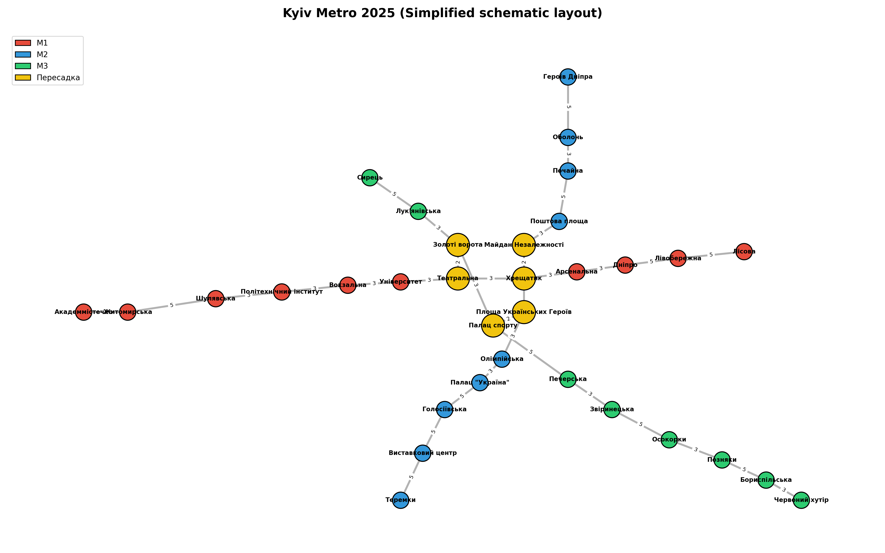

# goit-algo-hw-06
#  Домашнє завдання 6 (Завдання 1): Графи

##  Завдання 1: Створення та аналіз графа транспортної мережі

###  Опис завдання
Потрібно створити граф за допомогою бібліотеки **NetworkX**, який моделює реальну мережу, візуалізувати його та проаналізувати основні характеристики (кількість вершин, ребер, ступінь вершин тощо).

Для виконання завдання я обрала **спрощену схему Київського метрополітену 2025 року** з трьома гілками метро та основними станціями-пересадками.

---

## 🛠 Реалізація

У моделі використано три лінії:

- 🔴 **Червона лінія (M1)** — основна західно-східна гілка  
- 🔵 **Синя лінія (M2)** — північ-південь  
- 🟢 **Зелена лінія (M3)** — дуга від Сирця до Червоный хутір  

Між лініями додано станції-пересадки:

- **Театральна ↔ Золоті ворота** (M1 ↔ M3)  
- **Хрещатик ↔ Майдан Незалежності** (M1 ↔ M2)  
- **Площа Українських Героїв ↔ Палац спорту** (M2 ↔ M3)  

👉 Для того, щоб граф був **більш читабельним**, використана **спрощена схема метро 2025**: частину проміжних станцій було опущено, але збережена реальна топологія та логіка пересадок.

У коді:

- вершини — станції метро (мають атрибут `lines` — до яких гілок належить станція);
- ребра — з’єднання між сусідніми станціями (атрибут `time` — умовний час у хвилинах);
- окремо додаються ребра-пересадки між лініями.

### Ваги ребер (Edge weights)

Для моделювання реалістичної транспортної мережі метро Києва кожному ребру графа було присвоєно вагу `time`, яка відображає умовний час переходу між станціями:

- **3 хвилини** — стандартний перехід між сусідніми станціями на одній лінії  
- **4 хвилини** — пересадка між лініями (Театральна ↔ Золоті ворота, Хрещатик ↔ Майдан Незалежності, Площа Українських Героїв ↔ Палац спорту)  
- **5 хвилин** — "довгі" переходи, де при спрощенні схеми були видалені проміжні станції  
  (наприклад: Житомирська ↔ Шулявська, Дніпро ↔ Лівобережна)

Ці ваги використовуються в алгоритмі Дейкстри (Завдання 3) для пошуку найкоротшого шляху за часом.

---

##  Основні характеристики графа

###  Базові метрики

| Метрика                            | Значення   |
|------------------------------------|------------|
| Кількість вершин (станцій)         | **33**     |
| Кількість ребер (з’єднань)         | **33**     |
| Середній ступінь вершин            | **2.00**   |
| Щільність графа                    | **0.0625** |
| Діаметр                            | **14**     |
| Радіус                             | **7**      |
| Середній коефіцієнт кластеризації  | **0.0000** |

> Нульовий коефіцієнт кластеризації є типовим для “майже лінійних” транспортних мереж без трикутників (циклів довжини 3).

---

###  Найважливіші станції (betweenness centrality)

Найбільш значущі вершини за посередницькою центральністю (`betweenness_centrality`):

1. **Палац спорту** — `0.4083`  
2. **Театральна** — `0.3952`  
3. **Площа Українських Героїв** — `0.3931`  
4. **Майдан Незалежності** — `0.3639`  
5. **Хрещатик** — `0.3538`  

Ці станції лежать на більшості найкоротших маршрутів між іншими вершинами, тому є **критичними транзитними вузлами**.

---

###  Вузли пересадки (найбільший ступінь вершини = 3)

Станції з максимальною кількістю з’єднань у мережі:

Станції з максимальною кількістю з’єднань у мережі:

- **Театральна**  
- **Хрещатик**  
- **Майдан Незалежності**  
- **Площа Українських Героїв**  
- **Золоті ворота**  
- **Палац спорту**  

Вони забезпечують пересадку між гілками M1, M2 та M3 і формують **ядро всієї мережі**.

---

##  Візуалізація графа

Для візуалізації використана **схематична карта**, стилізована під реальну карту Київського метро:

- кольори вузлів відповідають лініям (M1, M2, M3);  
- пересадкові станції виділені **жовтим кольором**;  
- координати підібрані вручну для наближення до реальної схеми.

### Висновки Завдання 1
Граф успішно створено та проаналізовано  
Візуалізація демонструє структуру реальної мережі з кольоровим кодуванням ліній  
Станції для пересадки визначені як найважливіші вузли мережі  
Граф є зв'язаним (можна з будь-якої станції дістатись до будь-якої іншої)

##  Завдання 2: Порівняння алгоритмів DFS та BFS

###  Мета

На основі графа спрощеного метро Києва 2025 (побудованого у `task1.py`) реалізовано два алгоритми пошуку шляхів:

- **BFS (Breadth-First Search)** — пошук у ширину  
- **DFS (Depth-First Search)** — пошук у глибину  

Хоча обидва алгоритми працюють з одним і тим самим неорієнтованим графом, отримані маршрути часто суттєво відрізняються. Це дозволяє показати різницю в їхній стратегії обходу та ефективності.

---

##  Принципи роботи алгоритмів

### **🔵 BFS — Breadth-First Search (Пошук у ширину)**

**Як працює:**

- Використовує **чергу (FIFO)**
- Рухається *рівнями*: спочатку всі сусіди на відстані 1, потім 2, 3…
- Послідовно розширює “хвилю” пошуку

**Особливості:**

- ✅ **Гарантовано знаходить найкоротший шлях** (за кількістю ребер)
- Оптимальний для транспортних мереж і соціальних графів
- Відвідує більше вершин, ніж DFS

---

### **🔴 DFS — Depth-First Search (Пошук у глибину)**

**Як працює:**

- Використовує **стек (LIFO)**
- Йде *якнайглибше* по одному напрямку
- Використовує backtracking, коли шлях вичерпується

**Особливості:**

- ❗ **Не гарантує найкоротший маршрут**
- Може “застрягати” у глибоких гілках
- Результат сильно залежить від порядку сусідів у графі

---

## Результати порівняння

Алгоритми перевірені на трьох реальних маршрутах метро:

| Маршрут                               | BFS (ребер) | DFS (ребер) | Коментар |
|--------------------------------------|------------:|------------:|---------|
| Академмістечко → Лісова              | 11          | 15          | BFS чітко йде по одній лінії. DFS заходить у пересадковий вузол і робить зайвий “гачок”. |
| Героїв Дніпра → Червоний хутір       | 12          | 14          | BFS знаходить оптимальний перехід M2→M3 через центр. DFS “залипає” в центрі, створюючи обхід. |
| Сирець → Теремки                     | 9           | 11          | BFS швидко переходить між лініями. DFS знову йде глибше у те, що перше трапляється. |

> **Кількість ребер = кількість переходів між станціями**

---

## Чому DFS часто програє BFS?

У моделі метро є **центральний пересадковий хаб**:

- Театральна  
- Хрещатик  
- Майдан Незалежності  

DFS має властивість:

1. На першому ж розгалуженні обирати перше доступне ребро  
2. “Провалюватися” у глибину лінії  
3. Потім повертатися назад лише тоді, коли шлях вичерпано  

Через це він:

- робить зайві переходи через центр  
- не бачить коротші альтернативні варіанти  
- часто збільшує довжину маршруту на 2–4 ребра

BFS, навпаки:

- перевіряє всі варіанти рівномірно  
- не заходить “занадто глибоко” передчасно  
- тому завжди обирає оптимальний маршрут  

---

## Ключові відмінності між DFS і BFS

| Характеристика | DFS | BFS |
|----------------|-----|-----|
| Стратегія | Глибокий обхід однієї гілки | Пошук рівень за рівнем |
| Структура даних | Стек (LIFO) | Черга (FIFO) |
| Оптимальність | ❌ Не гарантується | ✅ Завжди |
| К-сть відвіданих вершин | Менша | Більша |
| Поведінка на метро-схемі | Зайві обхідні шляхи через центр | Найпряміший шлях |
| Залежність від порядку сусідів | Висока | Низька |

---

## Практичні висновки

- **BFS — найкращий вибір для навігації**, пошуку маршрутів, транспортних задач, GPS, соціальних мереж.  
- **DFS** варто використовувати у задачах:
  - структурування графа
  - пошуку компонент зв’язності
  - пошуку циклів
  - топологічного сортування
  - коли важливо зберігати памʼять

---

## Підсумок по Завданню 2

- BFS **завжди** знаходить найкоротший маршрут — і це підтверджено всіма тестами.  
- DFS дає коректний, але **не оптимальний** шлях.  
- На схемі метро DFS часто заходить у центральні пересадки, внаслідок чого маршрут подовжується.  
- Різниця в алгоритмах чітко демонструє, як стратегія обходу впливає на результат навіть у невеликій транспортній мережі.